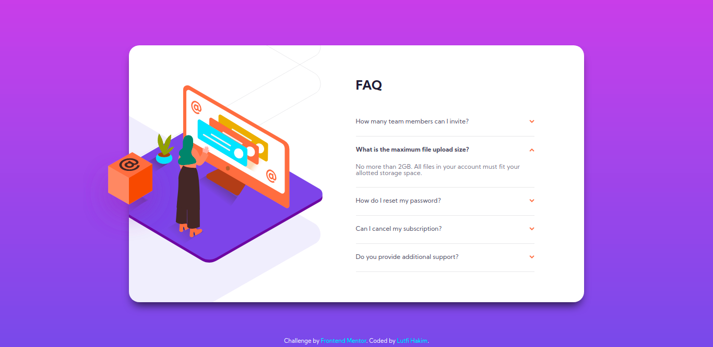

# Frontend Mentor - FAQ accordion card solution

This is a solution to the [FAQ accordion card challenge on Frontend Mentor](https://www.frontendmentor.io/challenges/faq-accordion-card-XlyjD0Oam). Frontend Mentor challenges help you improve your coding skills by building realistic projects. 

## Table of contents

- [Overview](#overview)
  - [The challenge](#the-challenge)
  - [Screenshot](#screenshot)
  - [Links](#links)
- [My process](#my-process)
  - [Built with](#built-with)
  - [What I learned](#what-i-learned)
  - [Continued development](#continued-development)
  - [Useful resources](#useful-resources)
- [Author](#author)

## Overview

### The challenge

Users should be able to:

- View the optimal layout for the component depending on their device's screen size
- See hover states for all interactive elements on the page
- Hide/Show the answer to a question when the question is clicked

### Screenshot

### Links

- Solution URL: [Add solution URL here](https://your-solution-url.com)
- Live Site URL: [Add live site URL here](https://your-live-site-url.com)

## My process

### Built with

- HTML
- CSS

### What I learned

I learn some stuff from this challenge, such as positioning, manipulating background image, etc.

### Continued development

This solution is good for now. But I want to try another tricks on handling animation.

### Useful resources

- [CSS Tricks](https://css-tricks.com/almanac/) - This helped me for styling and layouting with CSS.
- [W3Schools](https://www.w3schools.com/) - You already know what it this.
- [Stackoverflow](https://stackoverflow.com/) - When you get stuck, you go there.

## Author

- Frontend Mentor - [@lutfihakim28](https://www.frontendmentor.io/profile/lutfihakim28)
- Twitter - [@upilMarkupil](https://www.twitter.com/upilMarkupil)
